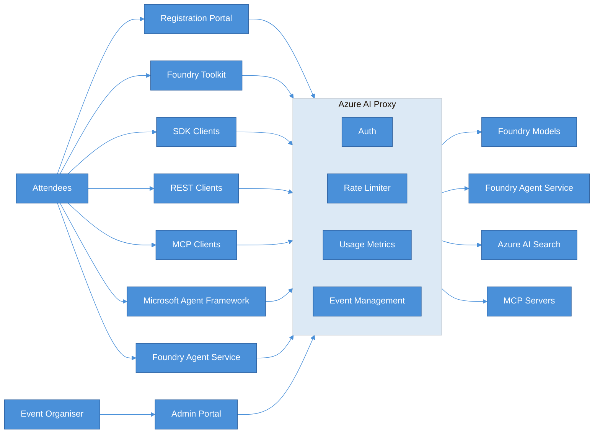
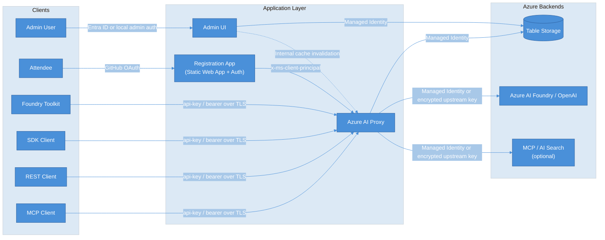

# Azure AI Proxy

A managed, multi-tenant proxy that sits between workshop attendees and Azure AI services, giving organisers full control over access, capacity, and usage tracking. Run multiple workshops simultaneously with full data isolation between events.

The solution documentation is published [here](https://microsoft.github.io/azure-ai-proxy-lite/).


## Architecture



### Broad AI Service Support

- Foundry Toolkit integration for hands-on model experimentation
- Azure OpenAI chat completions & embeddings (including streaming)
- Azure AI Foundry Service Agents (assistants, threads, files, conversations, responses)
- Azure AI Search pass-through for RAG scenarios
- MCP Server endpoints with streamable HTTP transport

### Event & Attendee Management

- Time-bound events with start/end windows — API keys only work during your workshop
- Self-service attendee registration via GitHub OAuth or shared codes (great for in-person sessions where not everyone has GitHub)
- Per-event resource assignment — choose exactly which models each event can access
- Full admin portal for creating events, managing resources, viewing metrics, and backup and restore

### Capacity Controls

- Daily request cap per attendee — prevents any one person from consuming all capacity
- Max token cap per request — stops runaway token usage

### Security

- Attendees never see your real Azure API keys or endpoints
- Encrypted storage for all sensitive configuration (AES encryption)
- Managed Identity support (eliminate API key storage entirely with RBAC)
- This update streamlines how the Foundry Agent Service operates by focusing on security and identity management:

  - **Managed Identity Integration**: Automatically maps Foundry Agent Service Managed Identity requirements to the Event API Key, ensuring seamless authentication.

  - **Object Ownership Isolation**: Enhances privacy by restricting access so attendees can only interact with their own agents, threads, and files.

### Security Architecture



The proxy is the main security boundary. Attendees authenticate through the registration flow or present an event API key to the proxy, but they never receive direct access to Azure AI resources or the organizer's real upstream credentials.

In Azure, the proxy and admin app use user-assigned managed identities with RBAC for storage and AI access. The proxy also enforces event-scoped authorization, time windows, daily request caps, and token caps before forwarding approved traffic upstream.

### Reporting & Analytics

- Per-event usage dashboards: request counts, token usage, active registrations over time
- Per-model breakdown of prompt/completion tokens
- Exportable backup of all configuration data

### Deployment

- One-command deploy with `azd up` (Container Apps + Static Web App + Table Storage)
- Docker Compose for local development
- Multi-tenant — run multiple workshops simultaneously with full data isolation

### Developer Experience

- Drop-in compatible with Azure OpenAI SDKs (Python, .NET, LangChain, REST)
- Attendees just swap their endpoint URL and use their issued API key
- Registration page shows available models and copy-paste configuration

## End-to-End Tests

Playwright tests are available under [tests/playwright](tests/playwright).

If you need to refresh Playwright dependencies manually:

```bash
npm run e2e:install
```

From the repository root:

```bash
npm run e2e:install
npm run e2e:test
```

Run authenticated E2E tests too:

```bash
E2E_RUN_AUTH_TESTS=true npm run e2e:test
```

Run the interactive UI runner:

```bash
npm run e2e:test:ui
```
