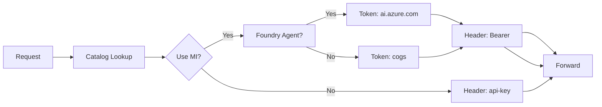

# Managed Identity Support for Azure AI Proxy

## Overview

This proxy supports **Azure Managed Identity** authentication to access Azure OpenAI Service and Azure AI Foundry Agent Service resources. This eliminates the need to store API keys — the proxy authenticates using its user-assigned managed identity and Azure RBAC.

## Required RBAC Permissions

The proxy's **user-assigned managed identity** needs different roles depending on which services it proxies to.

### Azure OpenAI Service

For proxying standard OpenAI endpoints (chat completions, embeddings):

| Role | Role ID | Scope | Purpose |
|------|---------|-------|---------|
| **Cognitive Services OpenAI User** | `5e0bd9bd-7b93-4f28-af87-19fc36ad61bd` | Azure OpenAI account | Read/write access to OpenAI deployments (chat, embeddings) |

**Token scope**: `https://cognitiveservices.azure.com/.default`

**Scope format**:
```
/subscriptions/<sub-id>/resourceGroups/<rg>/providers/Microsoft.CognitiveServices/accounts/<openai-account>
```

### Azure AI Foundry Agent Service

For proxying Foundry agent endpoints (agent CRUD, conversations, responses):

| Role | Role ID | Scope | Purpose |
|------|---------|-------|---------|
| **Cognitive Services OpenAI User** | `5e0bd9bd-7b93-4f28-af87-19fc36ad61bd` | AI Services hub account | Access to underlying OpenAI models used by agents |
| **Azure AI User** | `53ca6127-db72-4e31-b599-04dc5da150b4` | AI Foundry project | Full data-plane access for agent operations (create, run, delete agents, conversations, responses) |

**Token scope**: `https://ai.azure.com/.default`

> **Note**: The "Azure AI Developer" role is **not sufficient** for agent operations — it lacks the `Microsoft.CognitiveServices/accounts/AIServices/agents/write` data action. The "Azure AI User" role has wildcard `Microsoft.CognitiveServices/*` data actions that cover all agent operations.

**Scope formats**:
```
# Hub (for Cognitive Services OpenAI User)
/subscriptions/<sub-id>/resourceGroups/<rg>/providers/Microsoft.CognitiveServices/accounts/<hub-name>

# Project (for Azure AI User)
/subscriptions/<sub-id>/resourceGroups/<rg>/providers/Microsoft.CognitiveServices/accounts/<hub-name>/projects/<project-name>
```

### Foundry Endpoint URL Format

When adding a Foundry Agent model to the catalog, the endpoint URL must use the AI Services domain (not the Cognitive Services domain):

```
# Correct
https://<account>.services.ai.azure.com/api/projects/<project-name>

# Wrong — will result in 404s
https://<account>.cognitiveservices.azure.com/...
```

### Summary of All Roles

| Scenario | Role | Scope |
|----------|------|-------|
| OpenAI (chat, embeddings) | Cognitive Services OpenAI User | OpenAI account |
| Foundry Agents (model access) | Cognitive Services OpenAI User | AI Services hub |
| Foundry Agents (agent operations) | Azure AI User | AI Foundry project |

## Automated Setup

A script is provided to automate RBAC role assignment. You can download the helper script <a href="https://raw.githubusercontent.com/microsoft/azure-ai-proxy-lite/refs/heads/main/scripts/setup-managed-identity-rbac.sh" target="_blank">setup-managed-identity-rbac.sh</a>.


## Authentication Flow



### DefaultAzureCredential Chain

The proxy uses `DefaultAzureCredential` which tries authentication methods in order:

1. Environment variables
2. Managed Identity (in Azure — this is the primary path in production)
3. Visual Studio credentials
4. Azure CLI credentials (useful for local development)
5. Azure PowerShell credentials

## Usage

### Quick Start

1. **Deploy the proxy**
   ```bash
   azd up
   ```

2. **Run the RBAC setup script**
   ```bash
   ./scripts/setup-managed-identity-rbac.sh
   ```

3. **Add models in the Admin UI** with "Use Managed Identity" enabled

4. **Use the proxy** — no API keys needed

### Adding Models via Admin UI

1. Navigate to **Resources** → **+ New Resource**
2. Fill in:
   - **Friendly Name**: e.g., "Production GPT-4o"
   - **Deployment Name**: Your deployment name
   - **Type**: Select model type (e.g., `Foundry_Model`, `Foundry_Agent`)
   - **Endpoint**: Your endpoint URL
   - **Key**: Leave blank (not used with managed identity)
   - **Region**: Azure region
   - **Use Managed Identity**: ✓ Check this box
   - **Active**: ✓ Check to enable
3. Save

### For Developers — Testing Locally

The proxy uses `DefaultAzureCredential` which falls back to:

- **Azure CLI credentials**: Run `az login` first
- **Environment variables**: Set `AZURE_CLIENT_ID`, `AZURE_TENANT_ID`, `AZURE_CLIENT_SECRET`

## Backward Compatibility

- Existing API key-based models continue to work unchanged
- `UseManagedIdentity` defaults to `false`
- No breaking changes to existing deployments
- UI supports both authentication methods per model
