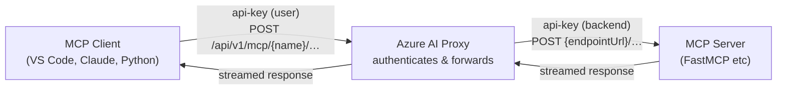

# MCP Server Deployment

The Azure AI Proxy supports pass-through proxying of [MCP (Model Context Protocol)](https://modelcontextprotocol.io/) servers using the **Streamable HTTP** transport. This lets you expose MCP tool servers to workshop attendees behind the same API-key authentication used for all other proxy endpoints, without revealing backend URLs or credentials.

## How It Works



1. **Client** sends requests to `https://<proxy-host>/api/v1/mcp/{deploymentName}/{path}` with an `api-key` header containing the user's proxy API key.
2. **Proxy** validates the API key, looks up the MCP catalog entry for the event, and forwards the request to the registered backend MCP server.
3. **Backend MCP server** receives the request with the backend `api-key` header (if configured) and returns a response.
4. **Proxy** streams the response back to the client, preserving SSE/streaming semantics.

### Key details

| Aspect | Detail |
|--------|--------|
| **Proxy URL pattern** | `/api/v1/mcp/{deploymentName}/{path}` |
| **Transport** | Streamable HTTP (MCP spec) |
| **Client auth** | `api-key` header — validated against attendee table |
| **Backend auth** | `api-key` header — from catalog's encrypted endpoint key |
| **Forwarded headers** | `Accept`, `Mcp-Session-Id`, `Last-Event-ID` |
| **Returned headers** | `Mcp-Session-Id` |
| **Timeout** | 120 seconds |
| **Streaming** | 4 KB chunks with per-chunk flush (SSE-friendly) |

## Securing the MCP Server with an API Key

There are **two separate API keys** involved in the MCP proxy flow:

```
Client API Key (attendee key)          Backend API Key (endpoint key)
──────────────────────────────         ──────────────────────────────
Issued to each attendee via the        Set on the MCP server itself
proxy admin UI.                        (MCP_API_KEY env var) and entered
                                       in the proxy catalog's "Key" field.
Sent by the client as:                 Sent by the proxy as:
  api-key: <attendee-key>               api-key: <endpoint-key>

Validated by the proxy against         Validated by the MCP server's
the attendee/event tables.             ApiKeyMiddleware.
```

The proxy **never** forwards the client's API key to the backend. It replaces it with the catalog's endpoint key.

### Configuring the backend API key

1. **On the MCP server**: Set the `MCP_API_KEY` environment variable to a secure random value.
2. **In the proxy admin UI**: When registering the MCP server catalog entry, enter the same value in the **Key** field.
3. The proxy encrypts and stores the key, then sends it as the `api-key` header on every forwarded request.

If you leave both the server's `MCP_API_KEY` and the catalog **Key** empty, no backend auth is enforced (useful for local development only).

## Step 1: Create an MCP Server

The MCP server must use the **Streamable HTTP transport**. Below is an example using Python [FastMCP](https://github.com/jlowin/fastmcp).

### `server.py`

```python
"""MCP Server with FastMCP - provides echo and get_current_utc_time tools."""

import logging
import os
from datetime import datetime, timezone

from fastmcp import FastMCP
from starlette.middleware import Middleware
from starlette.middleware.base import BaseHTTPMiddleware
from starlette.responses import JSONResponse

logging.basicConfig(level=logging.INFO)
logger = logging.getLogger(__name__)

API_KEY = os.environ.get("MCP_API_KEY", "")

mcp = FastMCP("Demo MCP Server")


class ApiKeyMiddleware(BaseHTTPMiddleware):
    """Validates the api-key header against MCP_API_KEY env var."""

    async def dispatch(self, request, call_next):
        provided_key = request.headers.get("api-key", "")
        if API_KEY and provided_key != API_KEY:
            logger.warning("Unauthorized request - api-key mismatch")
            return JSONResponse({"error": "Unauthorized"}, status_code=401)
        return await call_next(request)


@mcp.tool()
def echo(message: str) -> str:
    """Echoes the provided message back to the caller."""
    return message


@mcp.tool()
def get_current_utc_time() -> str:
    """Returns the current UTC time in ISO 8601 format."""
    return datetime.now(timezone.utc).isoformat()


if __name__ == "__main__":
    app = mcp.http_app(
        transport="streamable-http",
        middleware=[Middleware(ApiKeyMiddleware)],
    )

    import uvicorn
    uvicorn.run(app, host="0.0.0.0", port=8000)
```

### `requirements.txt`

```
fastmcp>=2.0.0
uvicorn
```

### `Dockerfile`

```dockerfile
FROM python:3.12-slim
WORKDIR /app
COPY requirements.txt .
RUN pip install --no-cache-dir -r requirements.txt
COPY server.py .
EXPOSE 8000
CMD ["python", "server.py"]
```

## Step 2: Deploy the MCP Server

Deploy the server anywhere accessible by the proxy (e.g. Azure Container Apps, Azure App Service, a VM). The `examples/python/openai_sdk_1.x/mcp/` directory includes Bicep templates and an `azure.yaml` for deploying to Azure Container Apps with `azd up`.

```bash
cd examples/python/openai_sdk_1.x/mcp
azd auth login
azd up
```

For local development, just run the server directly:

```bash
cd examples/python/openai_sdk_1.x/mcp/server
pip install -r requirements.txt
MCP_API_KEY="my-secret-key" python server.py
# Server starts at http://localhost:8000, MCP endpoint at http://localhost:8000/mcp
```

## Step 3: Register the MCP Server in the Proxy Admin UI

1. Log in to the proxy management UI.
2. Go to **Resources** → **+ New Resource**.
3. Fill in the fields:

    | Field | Value | Example |
    |-------|-------|---------|
    | **Friendly Name** | A human-readable label | `Demo MCP Server` |
    | **Deployment Name** | The URL path segment clients use | `mcp-demo` |
    | **Type** | Select **MCP Server** | |
    | **Endpoint URL** | Full URL to the MCP server endpoint | `https://mcp-server.azurecontainerapps.io/mcp` |
    | **Key** | The backend API key (optional) | The `MCP_API_KEY` value from the server |
    | **Region** | Any label | `eastus` |
    | **Active** | Checked | |

4. **Link the catalog to an event**: Edit the event and add the new MCP Server catalog so attendees of that event can access it.

!!! note
    The **Deployment Name** you set here is what clients use in the URL path: `/api/v1/mcp/{deploymentName}/...`

## Step 4: Connect a Client

### Python (FastMCP)

```python
import asyncio
import os
from fastmcp import Client
from fastmcp.client.transports import StreamableHttpTransport

async def main():
    proxy_url = os.environ["PROXY_ENDPOINT"]  # e.g. https://<proxy-host>/api/v1
    api_key = os.environ["PROXY_API_KEY"]      # your attendee API key
    deployment = "mcp-demo"                     # matches the Deployment Name in the catalog

    transport = StreamableHttpTransport(
        url=f"{proxy_url}/mcp/{deployment}/mcp",
        headers={"api-key": api_key},
    )

    async with Client(transport) as client:
        tools = await client.list_tools()
        print(f"Available tools: {[t.name for t in tools]}")

        result = await client.call_tool("echo", {"message": "Hello!"})
        print(f"Echo: {result}")

asyncio.run(main())
```

### VS Code (Copilot / GitHub Copilot Chat)

Add an MCP server entry to your VS Code settings (`.vscode/mcp.json` or user `settings.json`):

```json
{
  "servers": {
    "my-mcp-demo": {
      "type": "http",
      "url": "https://<proxy-host>/api/v1/mcp/mcp-demo/mcp",
      "headers": {
        "api-key": "<your-proxy-api-key>"
      }
    }
  }
}
```

### Claude Desktop

Add to your Claude Desktop config (`claude_desktop_config.json`):

```json
{
  "mcpServers": {
    "my-mcp-demo": {
      "type": "streamableHttp",
      "url": "https://<proxy-host>/api/v1/mcp/mcp-demo/mcp",
      "headers": {
        "api-key": "<your-proxy-api-key>"
      }
    }
  }
}
```

### curl (manual testing)

```bash
# Initialize session
curl -X POST "https://<proxy-host>/api/v1/mcp/mcp-demo/mcp" \
  -H "api-key: <your-proxy-api-key>" \
  -H "Content-Type: application/json" \
  -H "Accept: application/json, text/event-stream" \
  -d '{"jsonrpc":"2.0","id":1,"method":"initialize","params":{"protocolVersion":"2025-03-26","capabilities":{},"clientInfo":{"name":"test","version":"1.0"}}}'

# List tools (use Mcp-Session-Id from the initialize response)
curl -X POST "https://<proxy-host>/api/v1/mcp/mcp-demo/mcp" \
  -H "api-key: <your-proxy-api-key>" \
  -H "Content-Type: application/json" \
  -H "Accept: application/json, text/event-stream" \
  -H "Mcp-Session-Id: <session-id>" \
  -d '{"jsonrpc":"2.0","id":2,"method":"tools/list"}'
```

## Troubleshooting

| Issue | Check |
|-------|-------|
| `401 Unauthorized` from proxy | Verify your `api-key` header matches a valid, active attendee key for an active event |
| `404 Not Found` from proxy | Verify the deployment name in the URL matches the catalog entry, and the catalog is linked to your event |
| `401 Unauthorized` from backend | The catalog's **Key** field doesn't match the MCP server's `MCP_API_KEY` |
| `503 Service Unavailable` | The backend MCP server is unreachable or timed out (120s limit) |
| Client can't connect | Ensure you're using Streamable HTTP transport, not stdio or SSE-only |
| Session errors | The proxy forwards `Mcp-Session-Id` — ensure your client preserves it across requests |

## Example Project

A complete working example is in [`examples/python/openai_sdk_1.x/mcp/`](https://github.com/microsoft/azure-ai-proxy-lite/tree/main/examples/python/openai_sdk_1.x/mcp){:target="_blank"}:

```
mcp/
├── azure.yaml              # azd project config
├── server/
│   ├── server.py           # FastMCP server with api-key middleware
│   ├── requirements.txt
│   └── Dockerfile
├── client/
│   ├── client.py           # Python client via proxy
│   └── requirements.txt
└── infra/                  # Bicep templates for Azure Container Apps
```
