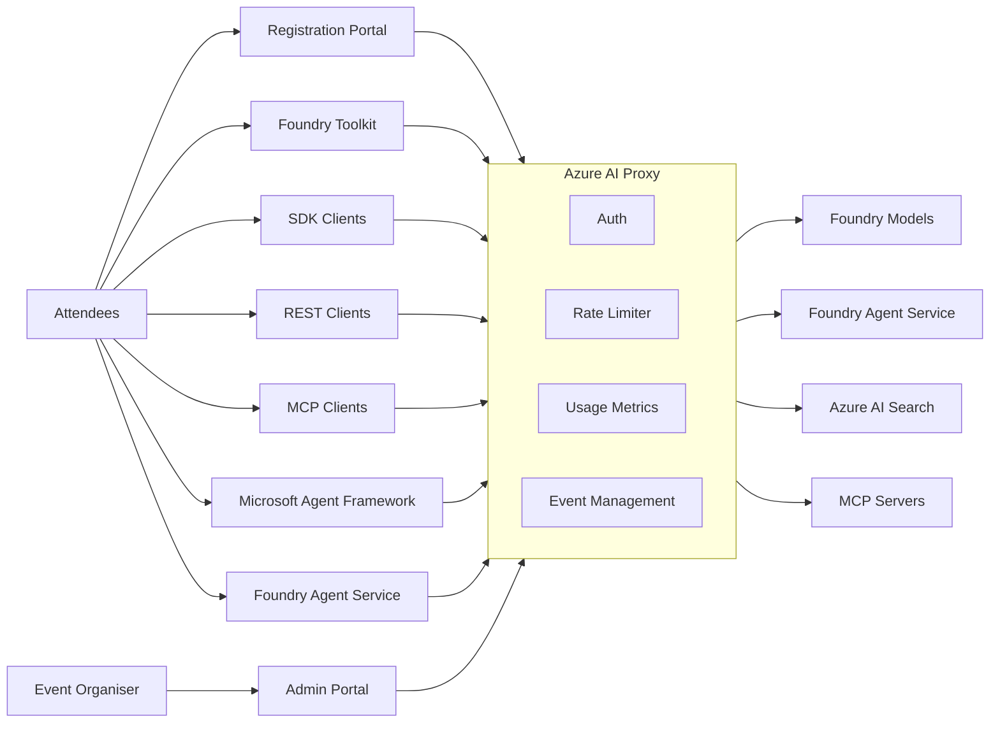

# Azure AI Proxy

<!--  -->

## Introduction to the Azure AI Proxy

A managed, multi-tenant proxy that sits between workshop attendees and Azure AI services, giving organisers full control over access, capacity, and usage tracking. Its purpose is to simplify running workshops, particularly community and online events, and make the attendee experience friction-free. Run multiple workshops simultaneously with full data isolation between events.

## Architecture

### Broad AI Service Support

- Foundry Toolkit integration for hands-on model experimentation
- Azure OpenAI chat completions & embeddings (including streaming)
- Azure AI Foundry Service Agents (assistants, threads, files, conversations, responses)
- Azure AI Search pass-through for RAG scenarios
- MCP Server endpoints with streamable HTTP transport

### Event & Attendee Management

- Time-bound events with start/end windows — API keys only work during your workshop
- Self-service attendee registration via GitHub OAuth or shared codes (great for in-person sessions where not everyone has GitHub)
- Per-event resource assignment — choose exactly which models each event can access
- Full admin portal for creating events, managing resources, viewing metrics, and backup and restore

### Capacity Controls

- Daily request cap per attendee — prevents any one person from consuming all capacity
- Max token cap per request — stops runaway token usage

### Security

- Attendees never see your real Azure API keys or endpoints
- Encrypted storage for all sensitive configuration (AES encryption)
- Managed Identity support (eliminate API key storage entirely with RBAC)
- This update streamlines how the Foundry Agent Service operates by focusing on security and identity management:

    - **Managed Identity Integration**: Automatically maps Foundry Agent Service Managed Identity requirements to the Event API Key, ensuring seamless authentication.

    - **Object Ownership Isolation**: Enhances privacy by restricting access so attendees can only interact with their own agents, threads, and files.

### Reporting & Analytics

- Per-event usage dashboards: request counts, token usage, active registrations over time
- Per-model breakdown of prompt/completion tokens
- Exportable backup of all configuration data

### Deployment

- One-command deploy with `azd up` (Container Apps + Static Web App + Table Storage)
- Docker Compose for local development
- Multi-tenant — run multiple workshops simultaneously with full data isolation

### Developer Experience

- Drop-in compatible with Azure OpenAI SDKs (Python, .NET, LangChain, REST)
- Attendees just swap their endpoint URL and use their issued API key
- Registration page shows available models and copy-paste configuration

## Getting Started with the Azure AI Proxy

Watch this 5-minute video to learn how to get started with the Azure AI Proxy.

<iframe width="672" height="378" src="https://www.youtube.com/embed/x9N1qivjlfw?si=tdgJv9bDAUabpnPt" title="YouTube video player" frameborder="0" allow="accelerometer; autoplay; clipboard-write; encrypted-media; gyroscope; picture-in-picture; web-share" referrerpolicy="strict-origin-when-cross-origin" allowfullscreen></iframe>

## Open Source

The Azure AI Proxy is an open-source project, licensed under MIT. You can find the source code on [GitHub](https://github.com/microsoft/azure-ai-proxy-lite){:target="_blank"}.

This project would not be possible without contributions from multiple people. Please feel free to contribute to the project by submitting a pull request or opening an issue.
